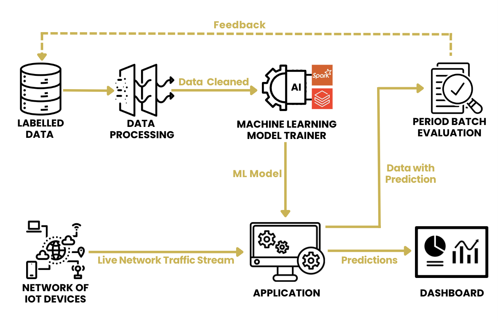

# Surveillance Sécurisée et Intelligente des Réseaux IoT

`Issa El Khaoua`

`Karim EL HOUMAINI`

## **Vue d'ensemble**

Les menaces en cybersécurité, en particulier les malwares, sont devenues de plus en plus difficiles à gérer en raison de l'évolution des vecteurs d'attaque sophistiqués. Ce projet propose une solution de grandes données visant à détecter les malwares dans les connexions réseau des appareils de l'Internet des Objets (IoT) en temps réel. Nous allons entraîner un modèle d'apprentissage automatique conçu pour détecter les malwares et déployer ce modèle afin de fournir une surveillance et des alertes de menaces en temps réel. Ce système devrait contribuer de manière significative aux protocoles de sécurité des secteurs sensibles, offrant une approche proactive de la défense contre les malwares et aidant à capturer les malwares en temps réel. Cette initiative améliore la sécurité du réseau et des appareils IoT, avec des objectifs clés axés sur la préservation de la confidentialité des données, le renforcement de la confiance des clients et la minimisation des coûts liés aux vulnérabilités de sécurité et aux risques de conformité.

## Dataset

Cette démonstration utilise un jeu de données étiquetées sur le trafic réseau généré par les appareils IoT. Il capture divers paramètres de connexion réseau et les étiquette comme malveillants ou bénins. (3,4 Go)

Ce jeu de données a été compilé par : « Laboratoire Stratosphère. Un jeu de données étiqueté avec trafic réseau IoT malveillant et bénin. 22 janvier. Agustin Parmisano, Sebastian Garcia, Maria Jose Erquiaga. [Jeux de données du laboratoire Stratosphère](https://www.stratosphereips.org/datasets-iot23) »

Lien vers le jeu de données utilisé : [Analyse de Connexion de Détection de Malware Réseau](https://www.kaggle.com/datasets/agungpambudi/network-malware-detection-connection-analysis)

## **Technologies et Outils Utilisés**

**Databricks** est une plateforme robuste connue pour sa scalabilité, son efficacité et sa flexibilité dans le support de plusieurs langages. Son intégration transparente avec Apache Spark et les espaces de travail collaboratifs simplifient l'apprentissage machine complexe et l'analytique en temps réel pour les grandes données. Avec cette plateforme, les organisations peuvent adapter efficacement les flux de travail pour traiter de grands volumes de données de trafic réseau et identifier l'activité malveillante de manière efficace. Ce projet démontre l'application pratique des outils de grandes données (Spark MLlib, Spark API, Databricks) en employant le modèle XGBoost à travers l'édition communautaire de Databricks pour aborder les problèmes de malware.

**Apache Spark** est un moteur de traitement de données distribué et unifié, conçu pour effectuer des tâches de traitement de données en batch et en temps réel à grande échelle, offrant ainsi une plateforme optimisée pour le traitement rapide et complexe de grandes quantités de données. **Spark MLlib** constitue la bibliothèque de Spark dédiée à l'apprentissage automatique, fournissant une gamme variée d'algorithmes et d'outils de machine learning destinés à faciliter la construction de modèles d'apprentissage automatique scalables et efficaces au sein de l'écosystème Spark. **L'API Spark**, quant à elle, désigne l'interface de programmation application qui permet aux développeurs d'interagir avec Spark en utilisant divers langages de programmation, tels que Scala, Python, et Java, pour créer et exécuter des tâches de traitement de données et d'apprentissage automatique de manière intuitive et flexible, exploitant ainsi toute la puissance de Spark pour le traitement des données et l'analyse prédictive.

## **Fonctionnement**

1. Téléchargez les données étiquetées sur le pilote Databricks.
2. Utilisez Spark MLlib dans le notebook **`data_engineering_and_ml_model_trainer.ipynb`** pour entraîner un modèle XGBoost avec les données étiquetées téléchargées. Stockez le modèle formé pour une utilisation ultérieure.
3. Créez une application de streaming Spark avec Spark API dans le notebook **`IoT_data_streaming_simulator.ipynb`** pour traiter les données réseau IoT vers Databricks. Pour ce projet, nous avons créé un simulateur qui imite le streaming de données réseau IoT en temps réel.
4. Appliquez le modèle formé dans le notebook **`final_application.ipynb`** aux données du simulateur de streaming pour faire des prédictions sur les activités potentielles de malware et créez un tableau de bord pour présenter les résultats pour que l'équipe commerciale les analyse en fonction des types d'appareils et des prédictions.
5. Effectuez périodiquement des évaluations par lots en comparant les résultats prédits avec les résultats réels pour évaluer la performance du modèle.
6. Fournissez un retour au formateur du modèle d'apprentissage automatique basé sur les évaluations. Améliorez l'algorithme pour améliorer les prédictions et s'adapter aux nouveaux types d'attaques de malware.

